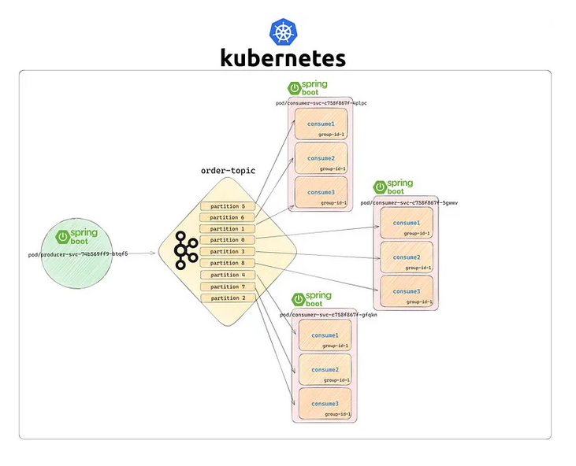

### Kafka Multiple Partitions with Spring Boot and Kubernetes
- The demo project with Spring boot & Apache Kafka for Order Processing service deploed k8s. 

## Flow Diagram


## Prerequisites
- Spring Boot (2.7.5)
- Maven 
- DOCKER
- Kubernetes
- Java (11)
- Libraries:
  * starter-web 
  * kafka
  * lombok/logback

  
## MiniKUBE (if you need to install MiniKube, please check 'How to setup MinuKube')
- Start MiniKube (if Windows, use Windows PowerShell)

```
minikube start 
```

- Get all PODs and Service 
```
kubectl get po,svc

```
- Important commands

```
minikube dashboard
minikube start (make sure local docker is running)
minikube service list

kubectl get node
kubectl get all
kubectl cluster-info
kubectl describe

```

- Deploy Zookeeper on Kubernetes

```
kubectl apply -f .\zookeeper-deployment.yaml

kubectl apply -f C:\Porjects\localRepo.vision.tech\spring2.7j11-kafka-k8\kafka-partitions-k8s\k8s

```
- Deploy Kafka on Kubernetes

```
kubectl apply -f .\kafka-deployment.yaml

```
- Kafdrop Deployment on Kubernetes
```
kubectl apply -f .\kafdrop-deployment.yaml

```

- Kafdrop Port Forward
```
kubectl port-forward service/kafdrop 9000:9000

```
- Visit http://127.0.0.1:9000

- Deploy Spring Producer App (order-service)
```
kubectl apply -f .\spring-producer-deployment.yaml
```
- Spring Producer App Port Forward
```
kubectl port-forward service/producer-svc 8080:8080
```

- Spring Boot Consumer App (stock-service [3 replicas] )```
kubectl apply -f .\spring-consumer-deployment.yaml

```

- Check all Replicas in Kubernetes
```
kubectl get replicaSet
```

- Spring Consumer App replica count:

* Visit again http://127.0.0.1:9000


- Send Http Request to Spring Producer App

* GET URL: http://localhost:8080/publish 


- Consumer Applications Logs
```
kubectl logs -f consumer-svc-c758f867f-4plpc

kubectl logs -f consumer-svc-c758f867f-5gwwv

kubectl logs -f consumer-svc-c758f867f-gfqkn 

```
### How to setup MinuKube (Windows)
- Deployment in dev (single node) and MiniCLI
- (1). In windows Powershell - run chocolatey.

```
Set-ExecutionPolicy Bypass -Scope Process -Force; [System.Net.ServicePointManager]::SecurityProtocol = [System.Net.ServicePointManager]::SecurityProtocol -bor 3072; iex ((New-Object System.Net.WebClient).DownloadString('https://community.chocolatey.org/install.ps1'))

```

- (2). Install MiniCli (if you have already Docker latest, you don't need it).

```
choco install kubernetes-cli
```

- (3). Install MiniKube (by using choco)
```
choco install minikube
```
- (4). Check your system Hyper-v enalble or not
```
systeminf (last line shows it is dected)
```

- (5). Enable Hyper-v in windows
Open Windows Sart menu (command box) and type features
Select Turn Windows features on of off
